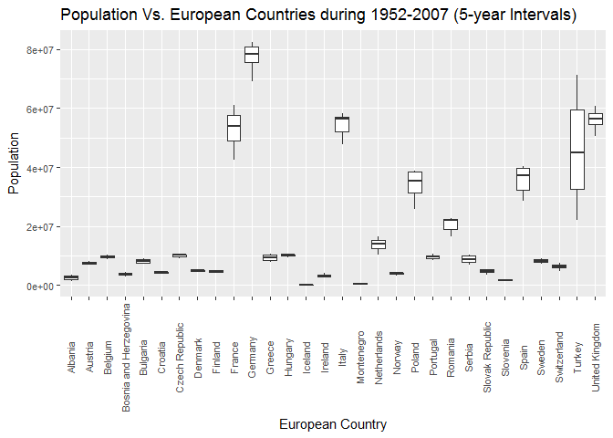
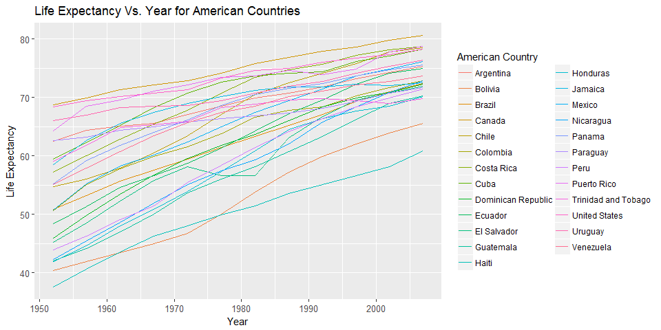
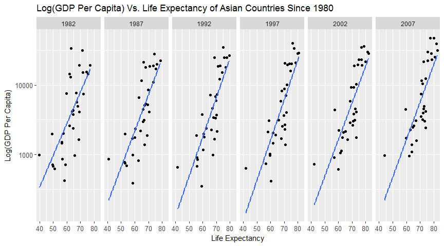

Plot Gapminder
================
Nikolas Krstic
September 15, 2017

Load necessary packages/data
----------------------------

``` r
suppressPackageStartupMessages(library(gapminder))
suppressPackageStartupMessages(library(tidyverse))
```

Gapminder Plots
---------------

### Boxplot of Population vs. European Countries

``` r
gapminder %>%
  filter(continent == "Europe") %>%
  select(country, pop) %>%
  ggplot(aes(x=country, y=pop))+
  labs(title="Population Vs. European Countries during 1952-2007 (5-year Intervals)", x="European Country", y="Population")+
  theme(axis.text.x = element_text(size=8, angle=90, vjust=0.4),
        axis.text.y = element_text(size=8))+
  geom_boxplot()
```



### Time Series of Life Expectancy in American Countries

``` r
gapminder %>%
  filter(continent == "Americas") %>%
  select(-gdpPercap, -pop) %>%
  ggplot(aes(x=year, y=lifeExp, colour=country))+
  labs(title="Life Expectancy Vs. Year for American Countries", x="Year", y="Life Expectancy", colour="American Country")+
  theme(axis.text.x = element_text(size=10),
        axis.text.y = element_text(size=10))+
  geom_line()
```



### Scatterplots of Log(GDP Per Capita) against Life Expectancy of Asian Countries Since 1980 (with Lines of Best Fit)

``` r
gapminder %>%
  filter(continent == "Asia", year %in% seq(1982, 2007, 5)) %>%
  select(-pop, -country) %>%
  ggplot(aes(x=lifeExp, y=gdpPercap))+
  facet_grid(~year)+
  labs(title="Log(GDP Per Capita) Vs. Life Expectancy of Asian Countries Since 1980", x="Life Expectancy", y="Log(GDP Per Capita)")+
  theme(axis.text.x = element_text(size=10),
        axis.text.y = element_text(size=10))+
  geom_point()+
  scale_y_log10()+
  geom_smooth(se=F, method="lm")
```


