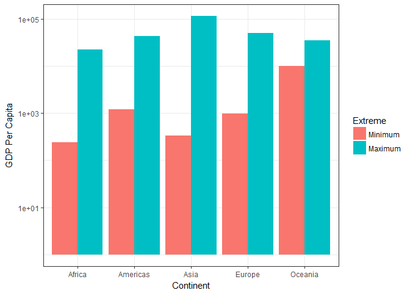
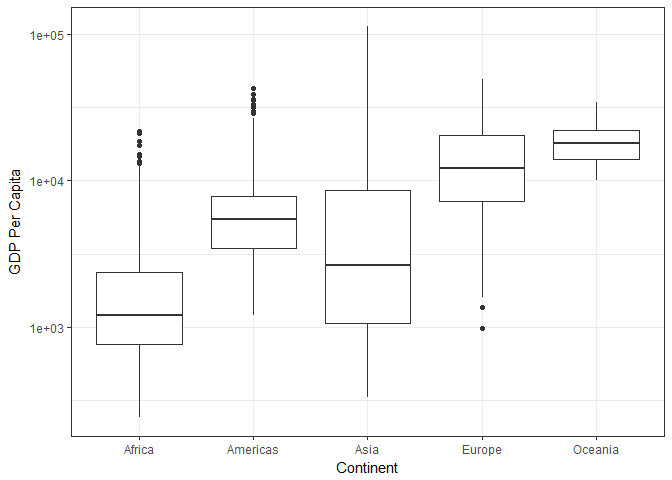
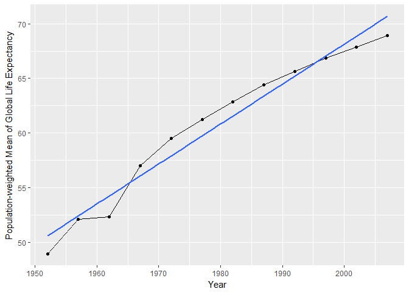

Further Gapminder Exploration
================
Nikolas Krstic
September 30, 2017

Load necessary packages/data
----------------------------

``` r
suppressPackageStartupMessages(library(gapminder))
suppressPackageStartupMessages(library(tidyverse))
suppressPackageStartupMessages(library(knitr))
suppressPackageStartupMessages(library(reshape))
```

    ## Warning: package 'reshape' was built under R version 3.4.2

``` r
suppressPackageStartupMessages(library(reshape2))
```

Maximum and Minimum GDP Per Capita for each Continent
-----------------------------------------------------

``` r
GDP_MM = gapminder %>%
  select(continent, gdpPercap) %>%
  group_by(continent) %>%
  summarize(min_gpc = min(gdpPercap), max_gpc = max(gdpPercap))

kable(GDP_MM, col.names=c("Continent", "Min. GDP Per Capita", "Max. GDP Per Capita"))
```

| Continent |  Min. GDP Per Capita|  Max. GDP Per Capita|
|:----------|--------------------:|--------------------:|
| Africa    |             241.1659|             21951.21|
| Americas  |            1201.6372|             42951.65|
| Asia      |             331.0000|            113523.13|
| Europe    |             973.5332|             49357.19|
| Oceania   |           10039.5956|             34435.37|

``` r
#Need to melt the dataframe to allow for side-by-side barplot
GDP_MM_2 = melt(as.data.frame(GDP_MM), id=c("continent"))

GDP_MM_2 %>%
  ggplot(aes(x=continent, y=value, fill=variable)) +
  theme_bw() +
  geom_bar(stat="identity", position="dodge") +
  scale_fill_discrete(name="Extreme",
                      labels=c("Minimum", "Maximum")) +
  labs(x="Continent", y="GDP Per Capita") +
  scale_y_log10()
```



The plot shows that Asia has a wide range of GDP Per Capita, with the difference between minimum and maximum GDP Per Capita being the largest among all the continents. Oceania seems to have the smallest difference, but this is likely due to only 2 countries being included within the dataset (Australia and New Zealand)

Spread of GDP Per Capita within each Continent
----------------------------------------------

``` r
GDP_Spread = gapminder %>%
  select(continent, gdpPercap) %>%
  group_by(continent) %>%
  summarize(sd = sd(gdpPercap), IQR = IQR(gdpPercap))

kable(GDP_Spread, col.names=c("Continent", "Standard Deviation of GDP Per Capita", "IQR of GDP Per Capita"))
```

| Continent |  Standard Deviation of GDP Per Capita|  IQR of GDP Per Capita|
|:----------|-------------------------------------:|----------------------:|
| Africa    |                              2827.930|               1616.170|
| Americas  |                              6396.764|               4402.431|
| Asia      |                             14045.373|               7492.262|
| Europe    |                              9355.213|              13248.301|
| Oceania   |                              6358.983|               8072.258|

``` r
gapminder %>%
  ggplot(aes(x=continent, y=gdpPercap)) +
  theme_bw() +
  geom_boxplot() +
  labs(x="Continent", y="GDP Per Capita") +
  scale_y_log10()
```



The spread of GDP Per Capita for Asia and Europe are particularly high compared to the others. Since the y-axis is on a log scale and according to the table, Europe has very large IQR, while both Asia and Europe have large standard deviations.

Population-weighted Mean of Global Life Expectancy for each Year
----------------------------------------------------------------

``` r
LE_MeanW = gapminder %>%
  select(lifeExp, year, pop) %>%
  group_by(year) %>%
  summarize(mean_weighted_lifeExp = weighted.mean(lifeExp, pop))

kable(LE_MeanW, col.names=c("Year", "Population-weighted Mean of Global Life Expectancy"))
```

|  Year|  Population-weighted Mean of Global Life Expectancy|
|-----:|---------------------------------------------------:|
|  1952|                                            48.94424|
|  1957|                                            52.12189|
|  1962|                                            52.32438|
|  1967|                                            56.98431|
|  1972|                                            59.51478|
|  1977|                                            61.23726|
|  1982|                                            62.88176|
|  1987|                                            64.41635|
|  1992|                                            65.64590|
|  1997|                                            66.84934|
|  2002|                                            67.83904|
|  2007|                                            68.91909|

``` r
LE_MeanW %>%
  ggplot(aes(x=year, y=mean_weighted_lifeExp)) +
  geom_line() +
  geom_point() +
  geom_smooth(method="lm", se=F) +
  labs(x="Year", y="Population-weighted Mean of Global Life Expectancy")
```



From the graph, we can see that global life expectancy has been steadily increasing over the years, with the blue line of best fit indicating the overal gradient for this dataset. It's interesting to see the plateau from 1957 to 1962, however. Further investigation may be required to see why that occurred, perhaps because of the various wars that occurred during that time period.

Mean Continental Life Expecatancy over Time
-------------------------------------------

``` r
LE_MeanC = gapminder %>%
  select(continent, lifeExp, year) %>%
  group_by(continent, year) %>%
  summarize(mean_lifeExp = mean(lifeExp))

LE_MeanC_2 = dcast(LE_MeanC, continent ~ year)
```

    ## Using mean_lifeExp as value column: use value.var to override.

``` r
kable(LE_MeanC_2, col.names=c("Continent", as.character(seq(1952, 2007, by=5))))
```

| Continent |      1952|      1957|      1962|      1967|      1972|      1977|      1982|      1987|      1992|      1997|      2002|      2007|
|:----------|---------:|---------:|---------:|---------:|---------:|---------:|---------:|---------:|---------:|---------:|---------:|---------:|
| Africa    |  39.13550|  41.26635|  43.31944|  45.33454|  47.45094|  49.58042|  51.59287|  53.34479|  53.62958|  53.59827|  53.32523|  54.80604|
| Americas  |  53.27984|  55.96028|  58.39876|  60.41092|  62.39492|  64.39156|  66.22884|  68.09072|  69.56836|  71.15048|  72.42204|  73.60812|
| Asia      |  46.31439|  49.31854|  51.56322|  54.66364|  57.31927|  59.61056|  62.61794|  64.85118|  66.53721|  68.02052|  69.23388|  70.72848|
| Europe    |  64.40850|  66.70307|  68.53923|  69.73760|  70.77503|  71.93777|  72.80640|  73.64217|  74.44010|  75.50517|  76.70060|  77.64860|
| Oceania   |  69.25500|  70.29500|  71.08500|  71.31000|  71.91000|  72.85500|  74.29000|  75.32000|  76.94500|  78.19000|  79.74000|  80.71950|
