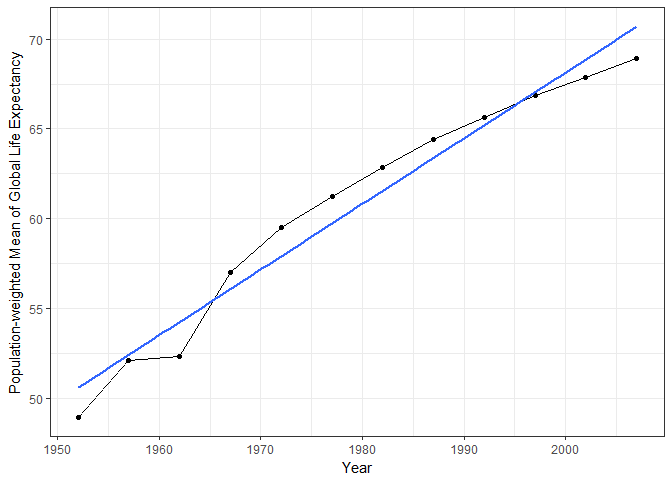
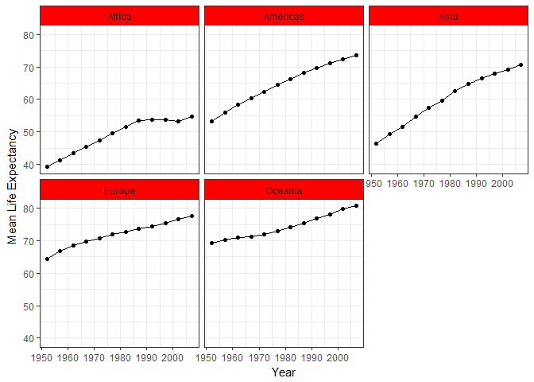
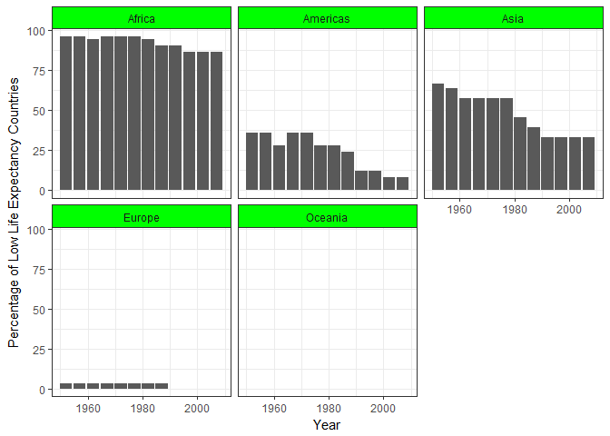

Further Gapminder Exploration
================
Nikolas Krstic
September 30, 2017

Load necessary packages/data
----------------------------

``` r
suppressPackageStartupMessages(library(gapminder))
suppressPackageStartupMessages(library(tidyverse))
suppressPackageStartupMessages(library(knitr))
suppressPackageStartupMessages(library(reshape))
```

    ## Warning: package 'reshape' was built under R version 3.4.2

``` r
suppressPackageStartupMessages(library(reshape2))
```

Maximum and Minimum GDP Per Capita for each Continent
-----------------------------------------------------

``` r
GDP_MM = gapminder %>%
  select(continent, gdpPercap) %>%
  group_by(continent) %>%
  summarize(min_gpc = min(gdpPercap), max_gpc = max(gdpPercap))

kable(GDP_MM, col.names=c("Continent", "Min. GDP Per Capita", "Max. GDP Per Capita"))
```

| Continent |  Min. GDP Per Capita|  Max. GDP Per Capita|
|:----------|--------------------:|--------------------:|
| Africa    |             241.1659|             21951.21|
| Americas  |            1201.6372|             42951.65|
| Asia      |             331.0000|            113523.13|
| Europe    |             973.5332|             49357.19|
| Oceania   |           10039.5956|             34435.37|

``` r
#Need to melt the dataframe to allow for side-by-side barplot
GDP_MM_2 = melt(as.data.frame(GDP_MM), id=c("continent"))

GDP_MM_2 %>%
  ggplot(aes(x=continent, y=value, fill=variable)) +
  theme_bw() +
  geom_bar(stat="identity", position="dodge") +
  scale_fill_discrete(name="Extreme",
                      labels=c("Minimum", "Maximum")) +
  labs(x="Continent", y="GDP Per Capita") +
  scale_y_log10()
```


The plot shows that Asia has a wide range of GDP Per Capita, with the difference between minimum and maximum GDP Per Capita being the largest among all the continents. Oceania seems to have the smallest difference, but this is likely due to only 2 countries being included within the dataset (Australia and New Zealand)

Spread of GDP Per Capita within each Continent
----------------------------------------------

``` r
GDP_Spread = gapminder %>%
  select(continent, gdpPercap) %>%
  group_by(continent) %>%
  summarize(sd = sd(gdpPercap), IQR = IQR(gdpPercap))

kable(GDP_Spread, col.names=c("Continent", "Standard Deviation of GDP Per Capita", "IQR of GDP Per Capita"))
```

| Continent |  Standard Deviation of GDP Per Capita|  IQR of GDP Per Capita|
|:----------|-------------------------------------:|----------------------:|
| Africa    |                              2827.930|               1616.170|
| Americas  |                              6396.764|               4402.431|
| Asia      |                             14045.373|               7492.262|
| Europe    |                              9355.213|              13248.301|
| Oceania   |                              6358.983|               8072.258|

``` r
gapminder %>%
  ggplot(aes(x=continent, y=gdpPercap)) +
  theme_bw() +
  geom_boxplot() +
  labs(x="Continent", y="GDP Per Capita") +
  scale_y_log10()
```


The spread of GDP Per Capita for Asia and Europe are particularly high compared to the others. Since the y-axis is on a log scale and according to the table, Europe has very large IQR, while both Asia and Europe have large standard deviations.

Population-weighted Mean of Global Life Expectancy for each Year
----------------------------------------------------------------

``` r
LE_MeanW = gapminder %>%
  select(lifeExp, year, pop) %>%
  group_by(year) %>%
  summarize(mean_weighted_lifeExp = weighted.mean(lifeExp, pop))

kable(LE_MeanW, col.names=c("Year", "Population-weighted Mean of Global Life Expectancy"))
```

|  Year|  Population-weighted Mean of Global Life Expectancy|
|-----:|---------------------------------------------------:|
|  1952|                                            48.94424|
|  1957|                                            52.12189|
|  1962|                                            52.32438|
|  1967|                                            56.98431|
|  1972|                                            59.51478|
|  1977|                                            61.23726|
|  1982|                                            62.88176|
|  1987|                                            64.41635|
|  1992|                                            65.64590|
|  1997|                                            66.84934|
|  2002|                                            67.83904|
|  2007|                                            68.91909|

``` r
LE_MeanW %>%
  ggplot(aes(x=year, y=mean_weighted_lifeExp)) +
  theme_bw() +
  geom_line() +
  geom_point() +
  geom_smooth(method="lm", se=F) +
  labs(x="Year", y="Population-weighted Mean of Global Life Expectancy")
```



From the graph, we can see that global life expectancy has been steadily increasing over the years, with the blue line of best fit indicating the overal gradient for this dataset. It's interesting to see the plateau from 1957 to 1962, however. Further investigation may be required to see why that occurred, perhaps because of the various wars that occurred during that time period.

Mean Continental Life Expecatancy over Time
-------------------------------------------

``` r
LE_MeanC = gapminder %>%
  select(continent, lifeExp, year) %>%
  group_by(continent, year) %>%
  summarize(mean_lifeExp = mean(lifeExp))

LE_MeanC_2 = dcast(LE_MeanC, continent ~ year)
```

    ## Using mean_lifeExp as value column: use value.var to override.

``` r
kable(LE_MeanC_2, col.names=c("Continent", as.character(seq(1952, 2007, by=5))))
```

| Continent |      1952|      1957|      1962|      1967|      1972|      1977|      1982|      1987|      1992|      1997|      2002|      2007|
|:----------|---------:|---------:|---------:|---------:|---------:|---------:|---------:|---------:|---------:|---------:|---------:|---------:|
| Africa    |  39.13550|  41.26635|  43.31944|  45.33454|  47.45094|  49.58042|  51.59287|  53.34479|  53.62958|  53.59827|  53.32523|  54.80604|
| Americas  |  53.27984|  55.96028|  58.39876|  60.41092|  62.39492|  64.39156|  66.22884|  68.09072|  69.56836|  71.15048|  72.42204|  73.60812|
| Asia      |  46.31439|  49.31854|  51.56322|  54.66364|  57.31927|  59.61056|  62.61794|  64.85118|  66.53721|  68.02052|  69.23388|  70.72848|
| Europe    |  64.40850|  66.70307|  68.53923|  69.73760|  70.77503|  71.93777|  72.80640|  73.64217|  74.44010|  75.50517|  76.70060|  77.64860|
| Oceania   |  69.25500|  70.29500|  71.08500|  71.31000|  71.91000|  72.85500|  74.29000|  75.32000|  76.94500|  78.19000|  79.74000|  80.71950|

``` r
LE_MeanC %>%
  ggplot(aes(x=year, y=mean_lifeExp)) +
  theme_bw() +
  facet_wrap(~continent) +
  geom_line() +
  geom_point() +
  labs(x="Year", y="Mean Life Expectancy") +
  theme(strip.background = element_rect(fill=c("red")))
```



From the graph, we can see that Europe and Oceania have had relatively high mean life expectancy over the years, gradually increasing. The Americas and Asia have pretty steep slopes, indicating the life expectancy was initially somewhat low, and has increased significantly over time. Africa had experienced increasing life expectancy up until the mid 80s, where it has now leveled off mostly.

Relative Abundance of Countries with Low Life Expectancy for each Continent.
----------------------------------------------------------------------------

``` r
# We'll use the mean global life expectancy (population-weighted) computed earlier as our benchmark, with any values below it being considered as low life expectancy.

LE_RA = gapminder %>%
  select(continent, country, lifeExp, year) %>%
  group_by(continent, country, year) %>%
  summarize(mean_lifeExp = mean(lifeExp)) %>%
  #Merge data with the mean life expectancies calculated before
  merge(LE_MeanW, by=c("year"), all.x=T) %>%
  #Create Boolean column, indicating if a country for a given year had low life
  #expectancy
  transmute(continent, country, year, Low_LifeExp = mean_lifeExp<mean_weighted_lifeExp) %>%
  group_by(year, continent) %>%
  #Count high or low life expectancy countries
  summarize(Low_count = sum(Low_LifeExp), High_count = sum(!Low_LifeExp)) %>%
  #Calculate percentages
  mutate(per_low_le = (Low_count)/(Low_count+High_count)*100) %>%
  select(-Low_count, -High_count) %>%
  arrange(continent)

kable(LE_RA, col.names=c("Year", "Continent", "Percentage of Countries with Low Life Expectancy"))
```

|  Year| Continent |  Percentage of Countries with Low Life Expectancy|
|-----:|:----------|-------------------------------------------------:|
|  1952| Africa    |                                         96.153846|
|  1957| Africa    |                                         96.153846|
|  1962| Africa    |                                         94.230769|
|  1967| Africa    |                                         96.153846|
|  1972| Africa    |                                         96.153846|
|  1977| Africa    |                                         96.153846|
|  1982| Africa    |                                         94.230769|
|  1987| Africa    |                                         90.384615|
|  1992| Africa    |                                         90.384615|
|  1997| Africa    |                                         86.538461|
|  2002| Africa    |                                         86.538461|
|  2007| Africa    |                                         86.538461|
|  1952| Americas  |                                         36.000000|
|  1957| Americas  |                                         36.000000|
|  1962| Americas  |                                         28.000000|
|  1967| Americas  |                                         36.000000|
|  1972| Americas  |                                         36.000000|
|  1977| Americas  |                                         28.000000|
|  1982| Americas  |                                         28.000000|
|  1987| Americas  |                                         24.000000|
|  1992| Americas  |                                         12.000000|
|  1997| Americas  |                                         12.000000|
|  2002| Americas  |                                          8.000000|
|  2007| Americas  |                                          8.000000|
|  1952| Asia      |                                         66.666667|
|  1957| Asia      |                                         63.636364|
|  1962| Asia      |                                         57.575758|
|  1967| Asia      |                                         57.575758|
|  1972| Asia      |                                         57.575758|
|  1977| Asia      |                                         57.575758|
|  1982| Asia      |                                         45.454546|
|  1987| Asia      |                                         39.393939|
|  1992| Asia      |                                         33.333333|
|  1997| Asia      |                                         33.333333|
|  2002| Asia      |                                         33.333333|
|  2007| Asia      |                                         33.333333|
|  1952| Europe    |                                          3.333333|
|  1957| Europe    |                                          3.333333|
|  1962| Europe    |                                          3.333333|
|  1967| Europe    |                                          3.333333|
|  1972| Europe    |                                          3.333333|
|  1977| Europe    |                                          3.333333|
|  1982| Europe    |                                          3.333333|
|  1987| Europe    |                                          3.333333|
|  1992| Europe    |                                          0.000000|
|  1997| Europe    |                                          0.000000|
|  2002| Europe    |                                          0.000000|
|  2007| Europe    |                                          0.000000|
|  1952| Oceania   |                                          0.000000|
|  1957| Oceania   |                                          0.000000|
|  1962| Oceania   |                                          0.000000|
|  1967| Oceania   |                                          0.000000|
|  1972| Oceania   |                                          0.000000|
|  1977| Oceania   |                                          0.000000|
|  1982| Oceania   |                                          0.000000|
|  1987| Oceania   |                                          0.000000|
|  1992| Oceania   |                                          0.000000|
|  1997| Oceania   |                                          0.000000|
|  2002| Oceania   |                                          0.000000|
|  2007| Oceania   |                                          0.000000|

``` r
LE_RA %>%
  ggplot(aes(x=year, y=per_low_le)) +
  theme_bw() +
  facet_wrap(~continent) +
  geom_bar(stat="identity") +
  labs(x="Year", y="Percentage of Low Life Expectancy Countries") +
  theme(strip.background = element_rect(fill=c("green")))
```



We can see from both the table and the graphs that Africa has had a high proportion of countries with a mean life expectancy below the global average over the years. Europe and Oceania though have had pretty high life expectancies across almost all countries over the years. Asia has 50% fewer low life expectancy countries since 1952 and the Americas has 75% fewer low life expectancy countries since 1952, which is pretty interesting.

Report on Process
-----------------

Overall, using dplyr and ggplot2 wasn't too difficult. I also decided to incorporate some use of the reshape/reshape2 packages to better manipulate the data ("melt" and "dcast" functions). This allowed me to produce better tables and graphs, in my opinion.

For the fifth plot, I was trying to make the bars colourful and representing relative percentages between low and high life expectancy countries. Each bar would reach 100%, but a fraction of the bar would be coloured to indicate the fraction of low life expectancy countries. However, I wasn't sure what the best approach to this was, as I only really know how to do it with factors and the fill parameter.

I did struggle a bit trying to figure out how to make the tables and graphs adjacent to one another, attempting to emulate the example provided. It may be that there's more to it than I was able to see, and I'm still interested in knowing how to do so.
