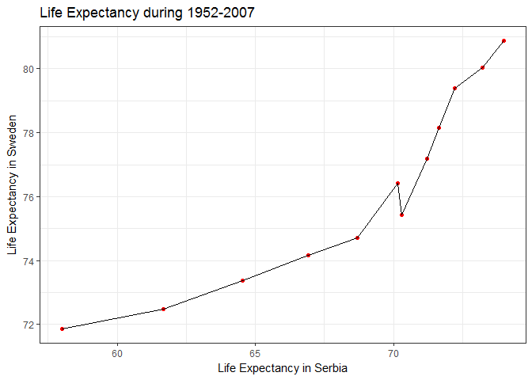

Gapminder\_Join\_and\_Reshape
================
Nikolas Krstic
October 7, 2017

``` r
suppressPackageStartupMessages(library(gapminder))
suppressPackageStartupMessages(library(tidyverse))
suppressPackageStartupMessages(library(knitr))
suppressPackageStartupMessages(library(reshape))
```

    ## Warning: package 'reshape' was built under R version 3.4.2

``` r
suppressPackageStartupMessages(library(reshape2))
suppressPackageStartupMessages(library(kableExtra))
```

    ## Warning: package 'kableExtra' was built under R version 3.4.2

Data Reshaping
--------------

### Activity 2: Annual Life Expectancy for Multiple Countries

``` r
chosen_countries = c("United Kingdom", "Spain", "France",
                        "Germany", "Serbia", "Italy", "Sweden")

lifeExp_countries = gapminder %>%
  filter(country %in% chosen_countries) %>%
  select(country, lifeExp, year) %>%
  group_by(country, year) %>%
  summarize(mean_lifeExp = mean(lifeExp)) %>%
  dcast(year ~ country)
```

    ## Using mean_lifeExp as value column: use value.var to override.

``` r
kable(lifeExp_countries, col.names = c("Year", names(lifeExp_countries)[2:ncol(lifeExp_countries)]))
```

|  Year|  France|  Germany|   Italy|  Serbia|   Spain|  Sweden|  United Kingdom|
|-----:|-------:|--------:|-------:|-------:|-------:|-------:|---------------:|
|  1952|  67.410|   67.500|  65.940|  57.996|  64.940|  71.860|          69.180|
|  1957|  68.930|   69.100|  67.810|  61.685|  66.660|  72.490|          70.420|
|  1962|  70.510|   70.300|  69.240|  64.531|  69.690|  73.370|          70.760|
|  1967|  71.550|   70.800|  71.060|  66.914|  71.440|  74.160|          71.360|
|  1972|  72.380|   71.000|  72.190|  68.700|  73.060|  74.720|          72.010|
|  1977|  73.830|   72.500|  73.480|  70.300|  74.390|  75.440|          72.760|
|  1982|  74.890|   73.800|  74.980|  70.162|  76.300|  76.420|          74.040|
|  1987|  76.340|   74.847|  76.420|  71.218|  76.900|  77.190|          75.007|
|  1992|  77.460|   76.070|  77.440|  71.659|  77.570|  78.160|          76.420|
|  1997|  78.640|   77.340|  78.820|  72.232|  78.770|  79.390|          77.218|
|  2002|  79.590|   78.670|  80.240|  73.213|  79.780|  80.040|          78.471|
|  2007|  80.657|   79.406|  80.546|  74.002|  80.941|  80.884|          79.425|

``` r
lifeExp_countries %>%
  ggplot(aes(x=Serbia, y=Sweden)) +
  theme_bw() +
  geom_point(colour="red") +
  geom_line() +
  labs(x="Life Expectancy in Serbia", y="Life Expectancy in Sweden", title="Life Expectancy during 1952-2007")
```



### Activity 3: Annual Maximum Life Expectancy within each Continent

``` r
lifeExp_continents = gapminder %>%
  select(continent, lifeExp, year) %>%
  group_by(continent, year) %>%
  summarize(max_lifeExp = max(lifeExp)) %>%
  dcast(year ~ continent)
```

    ## Using max_lifeExp as value column: use value.var to override.

``` r
kable(lifeExp_continents, col.names = c("Year", names(lifeExp_continents)[2:ncol(lifeExp_continents)]))
```

|  Year|  Africa|  Americas|    Asia|  Europe|  Oceania|
|-----:|-------:|---------:|-------:|-------:|--------:|
|  1952|  52.724|    68.750|  65.390|  72.670|   69.390|
|  1957|  58.089|    69.960|  67.840|  73.470|   70.330|
|  1962|  60.246|    71.300|  69.390|  73.680|   71.240|
|  1967|  61.557|    72.130|  71.430|  74.160|   71.520|
|  1972|  64.274|    72.880|  73.420|  74.720|   71.930|
|  1977|  67.064|    74.210|  75.380|  76.110|   73.490|
|  1982|  69.885|    75.760|  77.110|  76.990|   74.740|
|  1987|  71.913|    76.860|  78.670|  77.410|   76.320|
|  1992|  73.615|    77.950|  79.360|  78.770|   77.560|
|  1997|  74.772|    78.610|  80.690|  79.390|   78.830|
|  2002|  75.744|    79.770|  82.000|  80.620|   80.370|
|  2007|  76.442|    80.653|  82.603|  81.757|   81.235|

``` r
lifeExp_continents %>%
  select(-year) %>%
  plot(las=2, pch=16)
```


So, what's advantageous about this wide data format is that it's somewhat easier to generate pairwise combinations of each of the continents, to examine the trends in each of the scatterplots.

I was attempting to figure out whether there's a good way to implement this via ggplot, but it seems that ggplot typically accepts data in the long data format. It's possible to do so with one pair (as done in the previous section), but performing multiple combinations is somewhat messy.

### Activity 4: Minimum and Maximum Life Expectancies in each Continent

``` r
LE_Table = gapminder %>%
  select(year, continent, country, lifeExp) %>%
  group_by(year, continent) %>%
  filter(min_rank(desc(lifeExp)) < 2 | min_rank(lifeExp) < 2) %>% 
  arrange(year, continent) %>%
  #Generate boolean to identify min and max LEs
  mutate(max_bool = ifelse(max(lifeExp) == lifeExp, "Max_LE", "Min_LE")) %>%
  #dcast on this boolean, causes some NAs to pop up initially
  dcast(year+continent+country ~ max_bool, value.var="lifeExp") %>%
  #Repeate boolean generation on which country had the max or min LE
  mutate(max_bool = ifelse(!is.na(Max_LE), "Max_Country", "Min_Country")) %>%
  #dcast on this boolean too, results in disjoint NAs between the four columns made
  dcast(year+continent+Max_LE+Min_LE ~ max_bool, value.var="country") %>%
  group_by(year, continent) %>%
  #summarize across the rows to remove the NAs and combine the rows together
  summarize_all(funs(na.omit(.))) %>%
  arrange(continent, continent)

kable(LE_Table, col.names=c("Year", "Continent", "Max_LE", "Min_LE", "Country_with_Max_LE", "Country_with_Min_LE"))
```

|  Year| Continent |  Max\_LE|  Min\_LE| Country\_with\_Max\_LE | Country\_with\_Min\_LE |
|-----:|:----------|--------:|--------:|:-----------------------|:-----------------------|
|  1952| Africa    |   52.724|   30.000| Reunion                | Gambia                 |
|  1957| Africa    |   58.089|   31.570| Mauritius              | Sierra Leone           |
|  1962| Africa    |   60.246|   32.767| Mauritius              | Sierra Leone           |
|  1967| Africa    |   61.557|   34.113| Mauritius              | Sierra Leone           |
|  1972| Africa    |   64.274|   35.400| Reunion                | Sierra Leone           |
|  1977| Africa    |   67.064|   36.788| Reunion                | Sierra Leone           |
|  1982| Africa    |   69.885|   38.445| Reunion                | Sierra Leone           |
|  1987| Africa    |   71.913|   39.906| Reunion                | Angola                 |
|  1992| Africa    |   73.615|   23.599| Reunion                | Rwanda                 |
|  1997| Africa    |   74.772|   36.087| Reunion                | Rwanda                 |
|  2002| Africa    |   75.744|   39.193| Reunion                | Zambia                 |
|  2007| Africa    |   76.442|   39.613| Reunion                | Swaziland              |
|  1952| Americas  |   68.750|   37.579| Canada                 | Haiti                  |
|  1957| Americas  |   69.960|   40.696| Canada                 | Haiti                  |
|  1962| Americas  |   71.300|   43.428| Canada                 | Bolivia                |
|  1967| Americas  |   72.130|   45.032| Canada                 | Bolivia                |
|  1972| Americas  |   72.880|   46.714| Canada                 | Bolivia                |
|  1977| Americas  |   74.210|   49.923| Canada                 | Haiti                  |
|  1982| Americas  |   75.760|   51.461| Canada                 | Haiti                  |
|  1987| Americas  |   76.860|   53.636| Canada                 | Haiti                  |
|  1992| Americas  |   77.950|   55.089| Canada                 | Haiti                  |
|  1997| Americas  |   78.610|   56.671| Canada                 | Haiti                  |
|  2002| Americas  |   79.770|   58.137| Canada                 | Haiti                  |
|  2007| Americas  |   80.653|   60.916| Canada                 | Haiti                  |
|  1952| Asia      |   65.390|   28.801| Israel                 | Afghanistan            |
|  1957| Asia      |   67.840|   30.332| Israel                 | Afghanistan            |
|  1962| Asia      |   69.390|   31.997| Israel                 | Afghanistan            |
|  1967| Asia      |   71.430|   34.020| Japan                  | Afghanistan            |
|  1972| Asia      |   73.420|   36.088| Japan                  | Afghanistan            |
|  1977| Asia      |   75.380|   31.220| Japan                  | Cambodia               |
|  1982| Asia      |   77.110|   39.854| Japan                  | Afghanistan            |
|  1987| Asia      |   78.670|   40.822| Japan                  | Afghanistan            |
|  1992| Asia      |   79.360|   41.674| Japan                  | Afghanistan            |
|  1997| Asia      |   80.690|   41.763| Japan                  | Afghanistan            |
|  2002| Asia      |   82.000|   42.129| Japan                  | Afghanistan            |
|  2007| Asia      |   82.603|   43.828| Japan                  | Afghanistan            |
|  1952| Europe    |   72.670|   43.585| Norway                 | Turkey                 |
|  1957| Europe    |   73.470|   48.079| Iceland                | Turkey                 |
|  1962| Europe    |   73.680|   52.098| Iceland                | Turkey                 |
|  1967| Europe    |   74.160|   54.336| Sweden                 | Turkey                 |
|  1972| Europe    |   74.720|   57.005| Sweden                 | Turkey                 |
|  1977| Europe    |   76.110|   59.507| Iceland                | Turkey                 |
|  1982| Europe    |   76.990|   61.036| Iceland                | Turkey                 |
|  1987| Europe    |   77.410|   63.108| Switzerland            | Turkey                 |
|  1992| Europe    |   78.770|   66.146| Iceland                | Turkey                 |
|  1997| Europe    |   79.390|   68.835| Sweden                 | Turkey                 |
|  2002| Europe    |   80.620|   70.845| Switzerland            | Turkey                 |
|  2007| Europe    |   81.757|   71.777| Iceland                | Turkey                 |
|  1952| Oceania   |   69.390|   69.120| New Zealand            | Australia              |
|  1957| Oceania   |   70.330|   70.260| Australia              | New Zealand            |
|  1962| Oceania   |   71.240|   70.930| New Zealand            | Australia              |
|  1967| Oceania   |   71.520|   71.100| New Zealand            | Australia              |
|  1972| Oceania   |   71.930|   71.890| Australia              | New Zealand            |
|  1977| Oceania   |   73.490|   72.220| Australia              | New Zealand            |
|  1982| Oceania   |   74.740|   73.840| Australia              | New Zealand            |
|  1987| Oceania   |   76.320|   74.320| Australia              | New Zealand            |
|  1992| Oceania   |   77.560|   76.330| Australia              | New Zealand            |
|  1997| Oceania   |   78.830|   77.550| Australia              | New Zealand            |
|  2002| Oceania   |   80.370|   79.110| Australia              | New Zealand            |
|  2007| Oceania   |   81.235|   80.204| Australia              | New Zealand            |

This problem was a little more complicated to approach. Initially, I had only applied dcast to the table, but this resulted in many NA values (Countries were columns and the values were the life expectancies) and generally looked messy. The end result that I wanted was 4 columns, each indicating the min or max life expectancy or the country that had min or max life expectancy. There might be a more efficient way of doing that, but what I have done is pretty good and clear.

Data Joining
------------

### Activity 1: Gapminder Data Joining

``` r
chosen_countries = c("United Kingdom", "Spain", "France",
                        "Germany", "Serbia", "Italy", "Sweden", "Russia")

New_DF = data.frame(country = c("United Kingdom", "Spain", "France", "Germany", "Serbia", "Italy", "Sweden", "Russia"), Language = c("English", "Spanish", "French", "German", "Serbian", "Italian", "Swedish", "Russian"), Capital = c("London", "Madrid", "Paris", "Berlin", "Belgrade", "Rome", "Stockholm", "Moscow"), NATO_Member = c("Yes", "Yes", "Yes", "Yes", "No", "Yes", "No", "No"))

Old_DF = gapminder %>%
  filter(country %in% chosen_countries, year==2007)

kable(New_DF)
```

| country        | Language | Capital   | NATO\_Member |
|:---------------|:---------|:----------|:-------------|
| United Kingdom | English  | London    | Yes          |
| Spain          | Spanish  | Madrid    | Yes          |
| France         | French   | Paris     | Yes          |
| Germany        | German   | Berlin    | Yes          |
| Serbia         | Serbian  | Belgrade  | No           |
| Italy          | Italian  | Rome      | Yes          |
| Sweden         | Swedish  | Stockholm | No           |
| Russia         | Russian  | Moscow    | No           |

#### left\_join

"left\_join" preserves the columns and rows of the first data frame, while matching up new columns from the second data frame

``` r
kable(left_join(Old_DF, New_DF))
```

    ## Joining, by = "country"

    ## Warning: Column `country` joining factors with different levels, coercing
    ## to character vector

| country        | continent |  year|  lifeExp|       pop|  gdpPercap| Language | Capital   | NATO\_Member |
|:---------------|:----------|-----:|--------:|---------:|----------:|:---------|:----------|:-------------|
| France         | Europe    |  2007|   80.657|  61083916|  30470.017| French   | Paris     | Yes          |
| Germany        | Europe    |  2007|   79.406|  82400996|  32170.374| German   | Berlin    | Yes          |
| Italy          | Europe    |  2007|   80.546|  58147733|  28569.720| Italian  | Rome      | Yes          |
| Serbia         | Europe    |  2007|   74.002|  10150265|   9786.535| Serbian  | Belgrade  | No           |
| Spain          | Europe    |  2007|   80.941|  40448191|  28821.064| Spanish  | Madrid    | Yes          |
| Sweden         | Europe    |  2007|   80.884|   9031088|  33859.748| Swedish  | Stockholm | No           |
| United Kingdom | Europe    |  2007|   79.425|  60776238|  33203.261| English  | London    | Yes          |

#### right\_join

"right\_join" preserves the columns and rows of the second data frame, while matching up new columns from the first data frame

``` r
kable(right_join(Old_DF, New_DF))
```

    ## Joining, by = "country"

    ## Warning: Column `country` joining factors with different levels, coercing
    ## to character vector

| country        | continent |  year|  lifeExp|       pop|  gdpPercap| Language | Capital   | NATO\_Member |
|:---------------|:----------|-----:|--------:|---------:|----------:|:---------|:----------|:-------------|
| United Kingdom | Europe    |  2007|   79.425|  60776238|  33203.261| English  | London    | Yes          |
| Spain          | Europe    |  2007|   80.941|  40448191|  28821.064| Spanish  | Madrid    | Yes          |
| France         | Europe    |  2007|   80.657|  61083916|  30470.017| French   | Paris     | Yes          |
| Germany        | Europe    |  2007|   79.406|  82400996|  32170.374| German   | Berlin    | Yes          |
| Serbia         | Europe    |  2007|   74.002|  10150265|   9786.535| Serbian  | Belgrade  | No           |
| Italy          | Europe    |  2007|   80.546|  58147733|  28569.720| Italian  | Rome      | Yes          |
| Sweden         | Europe    |  2007|   80.884|   9031088|  33859.748| Swedish  | Stockholm | No           |
| Russia         | NA        |    NA|       NA|        NA|         NA| Russian  | Moscow    | No           |

#### inner\_join

"inner\_join" preserves the columns between both data frames, but only keeps rows that have matching values between the data frames (kind of like an intersection).

``` r
kable(inner_join(Old_DF, New_DF))
```

    ## Joining, by = "country"

    ## Warning: Column `country` joining factors with different levels, coercing
    ## to character vector

| country        | continent |  year|  lifeExp|       pop|  gdpPercap| Language | Capital   | NATO\_Member |
|:---------------|:----------|-----:|--------:|---------:|----------:|:---------|:----------|:-------------|
| France         | Europe    |  2007|   80.657|  61083916|  30470.017| French   | Paris     | Yes          |
| Germany        | Europe    |  2007|   79.406|  82400996|  32170.374| German   | Berlin    | Yes          |
| Italy          | Europe    |  2007|   80.546|  58147733|  28569.720| Italian  | Rome      | Yes          |
| Serbia         | Europe    |  2007|   74.002|  10150265|   9786.535| Serbian  | Belgrade  | No           |
| Spain          | Europe    |  2007|   80.941|  40448191|  28821.064| Spanish  | Madrid    | Yes          |
| Sweden         | Europe    |  2007|   80.884|   9031088|  33859.748| Swedish  | Stockholm | No           |
| United Kingdom | Europe    |  2007|   79.425|  60776238|  33203.261| English  | London    | Yes          |

#### full\_join

"full\_join" preserves both the columns and rows between both data frames (kind of like a union)

``` r
kable(full_join(Old_DF, New_DF))
```

    ## Joining, by = "country"

    ## Warning: Column `country` joining factors with different levels, coercing
    ## to character vector

| country        | continent |  year|  lifeExp|       pop|  gdpPercap| Language | Capital   | NATO\_Member |
|:---------------|:----------|-----:|--------:|---------:|----------:|:---------|:----------|:-------------|
| France         | Europe    |  2007|   80.657|  61083916|  30470.017| French   | Paris     | Yes          |
| Germany        | Europe    |  2007|   79.406|  82400996|  32170.374| German   | Berlin    | Yes          |
| Italy          | Europe    |  2007|   80.546|  58147733|  28569.720| Italian  | Rome      | Yes          |
| Serbia         | Europe    |  2007|   74.002|  10150265|   9786.535| Serbian  | Belgrade  | No           |
| Spain          | Europe    |  2007|   80.941|  40448191|  28821.064| Spanish  | Madrid    | Yes          |
| Sweden         | Europe    |  2007|   80.884|   9031088|  33859.748| Swedish  | Stockholm | No           |
| United Kingdom | Europe    |  2007|   79.425|  60776238|  33203.261| English  | London    | Yes          |
| Russia         | NA        |    NA|       NA|        NA|         NA| Russian  | Moscow    | No           |

#### semi\_join

"semi\_join" preserves only the columns of the first data frame, and only keeps the specific rows of the first data frame if they match up with the second data frame

``` r
kable(semi_join(Old_DF, New_DF))
```

    ## Joining, by = "country"

    ## Warning: Column `country` joining factors with different levels, coercing
    ## to character vector

| country        | continent |  year|  lifeExp|       pop|  gdpPercap|
|:---------------|:----------|-----:|--------:|---------:|----------:|
| France         | Europe    |  2007|   80.657|  61083916|  30470.017|
| Germany        | Europe    |  2007|   79.406|  82400996|  32170.374|
| Italy          | Europe    |  2007|   80.546|  58147733|  28569.720|
| Serbia         | Europe    |  2007|   74.002|  10150265|   9786.535|
| Spain          | Europe    |  2007|   80.941|  40448191|  28821.064|
| Sweden         | Europe    |  2007|   80.884|   9031088|  33859.748|
| United Kingdom | Europe    |  2007|   79.425|  60776238|  33203.261|

#### anti\_join

"anti\_join" preserves only the columns of the first data frame, and only keeps the specific rows of the first data frame if they DON'T match up with the second data frame

``` r
kable(anti_join(Old_DF, New_DF))
```

    ## Joining, by = "country"

    ## Warning: Column `country` joining factors with different levels, coercing
    ## to character vector

country continent year lifeExp pop gdpPercap -------- ---------- ----- -------- ---- ----------

NOTE: I spent a lot of time trying to figure out how to put the above data frames into scroll boxes so that they don't take so much space on the page. However, I can't seem to do so, since I think this can only be done via the HTML format. Instead, I've resorted to filtering down the original gapminder to only the year 2007. Slightly disappointing.

### Activity 3: Looking at "merge" and "match"

``` r
merge(Old_DF, New_DF, by="country", all=T)
```

    ##          country continent year lifeExp      pop gdpPercap Language
    ## 1         France    Europe 2007  80.657 61083916 30470.017   French
    ## 2        Germany    Europe 2007  79.406 82400996 32170.374   German
    ## 3          Italy    Europe 2007  80.546 58147733 28569.720  Italian
    ## 4         Serbia    Europe 2007  74.002 10150265  9786.535  Serbian
    ## 5          Spain    Europe 2007  80.941 40448191 28821.064  Spanish
    ## 6         Sweden    Europe 2007  80.884  9031088 33859.748  Swedish
    ## 7 United Kingdom    Europe 2007  79.425 60776238 33203.261  English
    ## 8         Russia      <NA>   NA      NA       NA        NA  Russian
    ##     Capital NATO_Member
    ## 1     Paris         Yes
    ## 2    Berlin         Yes
    ## 3      Rome         Yes
    ## 4  Belgrade          No
    ## 5    Madrid         Yes
    ## 6 Stockholm          No
    ## 7    London         Yes
    ## 8    Moscow          No

merge is pretty similar to the other joins. Setting the argument "all" to TRUE, then this is similar to full\_join. Setting it to FALSE is similar to using inner\_join. Then using all.x or all.y (setting one to TRUE and the other to FALSE) is similar to using left\_join or right\_join. I don't believe there is an equivalent to semi\_join or anti\_join for merge.

``` r
match(Old_DF$country, New_DF$country)
```

    ## [1] 3 4 6 5 2 7 1

match, on the other hand, compares two vectors and indicates the position at which each component of the first vector matches up with the second. This is similar to anti\_join and semi\_join in that we can use the output of match to filter any mismatches out. However, it has minimal similarity to the merge function.
