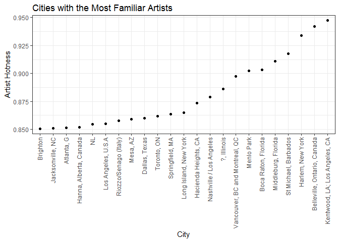
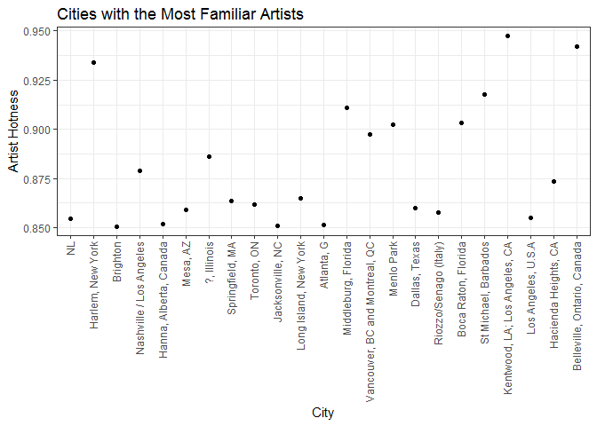

Singer\_Locations\_Factors\_and\_Writing
================
Nikolas Krstic
October 13, 2017

``` r
suppressPackageStartupMessages(library(gapminder))
suppressPackageStartupMessages(library(tidyverse))
suppressPackageStartupMessages(library(knitr))
suppressPackageStartupMessages(library(reshape))
```

    ## Warning: package 'reshape' was built under R version 3.4.2

``` r
suppressPackageStartupMessages(library(reshape2))
suppressPackageStartupMessages(library(kableExtra))
```

    ## Warning: package 'kableExtra' was built under R version 3.4.2

``` r
suppressPackageStartupMessages(library(forcats))
```

    ## Warning: package 'forcats' was built under R version 3.4.2

``` r
suppressPackageStartupMessages(library(devtools))
```

    ## Warning: package 'devtools' was built under R version 3.4.2

``` r
suppressPackageStartupMessages(library(singer))
suppressPackageStartupMessages(library(forcats))
```

Factor Management
-----------------

``` r
data("singer_locations")
```

We're going to factorise on the following variables: artist\_name, name and city. This is because of the following information we have on the unique values of each of the categorical variables (that are not identifiers):

``` r
#10100
nrow(singer_locations)
```

    ## [1] 10100

``` r
#9799, too high and close to nrow value, not useful to factorise
length(unique(singer_locations$title))
```

    ## [1] 9799

``` r
#9049, too high again
length(unique(singer_locations$release))
```

    ## [1] 9049

``` r
#7498, acceptable because of absence of NAs
length(unique(singer_locations$artist_name))
```

    ## [1] 7498

``` r
#2913, good enough
length(unique(singer_locations$name))
```

    ## [1] 2913

``` r
#1317, good enough as well
length(unique(singer_locations$release))
```

    ## [1] 9049

#### Check for NA count

``` r
#5968
sum(is.na(singer_locations$name))
```

    ## [1] 5968

``` r
#0
sum(is.na(singer_locations$artist_name))
```

    ## [1] 0

``` r
#5971
sum(is.na(singer_locations$city))
```

    ## [1] 5971

### Factorisation

``` r
#Replace any NAs present with "Missing Information", to allow us to use as_factor
sl_new <- singer_locations %>%
  mutate(name = ifelse(is.na(singer_locations$name), "Missing Information", singer_locations$name), artist_name = ifelse(is.na(singer_locations$artist_name), "Missing Information", singer_locations$artist_name), city = ifelse(is.na(singer_locations$city), "Missing Information", singer_locations$city))

sl_new <- sl_new %>%
  mutate(name_factor = as_factor(sl_new$name), artist_name_factor = as_factor(sl_new$artist_name), city_factor = as_factor(sl_new$city))
```

It should be noted that as\_factor sets the levels in the order that they first appear in the data, while as.factor sets the levels in alphabetical order. A serious drawback to as\_factor though is that the NAs within a variable hinder its ability to factorise. This is not a problem with as.factor, and usually you will end up changing the order of factor levels, regardless of whether you use either function.

#### Name of specific singer

``` r
#Number of levels
nlevels(sl_new$name_factor)
```

    ## [1] 2913

``` r
#Some sample levels
head(levels(sl_new$name_factor), n=10)
```

    ##  [1] "Missing Information"      "Gene Chandler"           
    ##  [3] "Paul Horn"                "Dorothy Ashby"           
    ##  [5] "Barleyjuice"              "Madlib"                  
    ##  [7] "Seeed feat. Elephant Man" "Keali I Reichel"         
    ##  [9] "Little Feat"              "Joan Baez"

#### Artist name (can be band/singer/artist/etc.)

``` r
nlevels(sl_new$artist_name_factor)
```

    ## [1] 7498

``` r
head(levels(sl_new$artist_name_factor), n=10)
```

    ##  [1] "Motion City Soundtrack"         "Gene Chandler"                 
    ##  [3] "Paul Horn"                      "Ronnie Earl & the Broadcasters"
    ##  [5] "Dorothy Ashby"                  "Barleyjuice"                   
    ##  [7] "Vertigo Angels"                 "Wir Sind Helden"               
    ##  [9] "Simon & Garfunkel"              "Rabia Sorda"

#### City

``` r
nlevels(sl_new$city_factor)
```

    ## [1] 1317

``` r
head(levels(sl_new$city_factor), n=10)
```

    ##  [1] "Missing Information" "Chicago, IL"         "New York, NY"       
    ##  [4] "Detroit, MI"         "Pennsylvania"        "Oxnard, CA"         
    ##  [7] "Bonn"                "Hawaii"              "Los Angeles, CA"    
    ## [10] "Staten Island, NY"

### Removal of year 0 from dataset and drop factor levels

``` r
sl_new2 <- sl_new %>%
  filter(year != 0) %>%
  droplevels()

nrow(sl_new2)
```

    ## [1] 10000

We had 100 observations that were year 0. We examine how the factors have changed as well.

#### Name of specific singer

``` r
#Number of levels
nlevels(sl_new2$name_factor)
```

    ## [1] 2879

``` r
#Some sample levels
head(levels(sl_new2$name_factor), n=10)
```

    ##  [1] "Missing Information"      "Gene Chandler"           
    ##  [3] "Paul Horn"                "Dorothy Ashby"           
    ##  [5] "Barleyjuice"              "Madlib"                  
    ##  [7] "Seeed feat. Elephant Man" "Keali I Reichel"         
    ##  [9] "Little Feat"              "Joan Baez"

We have 34 levels that were dropped.

#### Artist name (can be band/singer/artist/etc.)

``` r
nlevels(sl_new2$artist_name_factor)
```

    ## [1] 7408

``` r
head(levels(sl_new2$artist_name_factor), n=10)
```

    ##  [1] "Motion City Soundtrack"         "Gene Chandler"                 
    ##  [3] "Paul Horn"                      "Ronnie Earl & the Broadcasters"
    ##  [5] "Dorothy Ashby"                  "Barleyjuice"                   
    ##  [7] "Vertigo Angels"                 "Wir Sind Helden"               
    ##  [9] "Simon & Garfunkel"              "Rabia Sorda"

We have 90 levels that were dropped.

#### City

``` r
nlevels(sl_new2$city_factor)
```

    ## [1] 1309

``` r
head(levels(sl_new2$city_factor), n=10)
```

    ##  [1] "Missing Information" "Chicago, IL"         "New York, NY"       
    ##  [4] "Detroit, MI"         "Pennsylvania"        "Oxnard, CA"         
    ##  [7] "Bonn"                "Hawaii"              "Los Angeles, CA"    
    ## [10] "Staten Island, NY"

We have 8 levels that were dropped.

### Reordering the levels of arist\_name\_factor by maximum artist\_familiarity

``` r
sl_new3 <- sl_new2 %>%
  mutate(artist_name_factor = fct_reorder(artist_name_factor, artist_familiarity, max))

head(levels(sl_new3$artist_name_factor), n=10)
```

    ##  [1] "Captain Capa"                        
    ##  [2] "Ella Washington"                     
    ##  [3] "Madness"                             
    ##  [4] "The (International) Noise Conspiracy"
    ##  [5] "Ludovico Einaudi & Ballaké Sissoko"  
    ##  [6] "Fight K5"                            
    ##  [7] "Antonio MacHin"                      
    ##  [8] "Retractor"                           
    ##  [9] "Cricco Castelli"                     
    ## [10] "Chuck Durfor"

Factor levels have been reordered.

### Writing and Reading to File

``` r
sl_new4 <- sl_new3 %>%
  mutate(city_factor = fct_reorder(city_factor, artist_familiarity, max)) %>%
  group_by(city_factor) %>%
  summarize(mean_artist_hotttnesss = mean(artist_hotttnesss))

head(levels(sl_new4$city_factor), n=10)
```

    ##  [1] "Darmstadt"               "namsos, NO"             
    ##  [3] "Memphis TN"              "New Hampshire"          
    ##  [5] "Chapel Hill NC"          "Duluth, MN"             
    ##  [7] "Algeria"                 "Bonn"                   
    ##  [9] "milwaulkee/atl/brooklyn" "Dougherty, OK"

``` r
write_csv(sl_new4, paste(getwd(), "/Data/Artist_Hotness_Data.csv", sep=""))
sl_new5 <- read_csv(paste(getwd(), "/Data/Artist_Hotness_Data.csv", sep=""))
```

    ## Parsed with column specification:
    ## cols(
    ##   city_factor = col_character(),
    ##   mean_artist_hotttnesss = col_double()
    ## )

``` r
str(sl_new5)
```

    ## Classes 'tbl_df', 'tbl' and 'data.frame':    1309 obs. of  2 variables:
    ##  $ city_factor           : chr  "Darmstadt" "namsos, NO" "Memphis TN" "New Hampshire" ...
    ##  $ mean_artist_hotttnesss: num  0.496 0.375 0.328 0.374 0.244 ...
    ##  - attr(*, "spec")=List of 2
    ##   ..$ cols   :List of 2
    ##   .. ..$ city_factor           : list()
    ##   .. .. ..- attr(*, "class")= chr  "collector_character" "collector"
    ##   .. ..$ mean_artist_hotttnesss: list()
    ##   .. .. ..- attr(*, "class")= chr  "collector_double" "collector"
    ##   ..$ default: list()
    ##   .. ..- attr(*, "class")= chr  "collector_guess" "collector"
    ##   ..- attr(*, "class")= chr "col_spec"

It appears that the factor was not preserved with write\_csv

``` r
saveRDS(sl_new4, paste(getwd(), "/Data/Artist_Hotness_Data.csv", sep=""))
sl_new5 <- readRDS(paste(getwd(), "/Data/Artist_Hotness_Data.csv", sep=""))

str(sl_new5)
```

    ## Classes 'tbl_df', 'tbl' and 'data.frame':    1309 obs. of  2 variables:
    ##  $ city_factor           : Factor w/ 1309 levels "Darmstadt","namsos, NO",..: 1 2 3 4 5 6 7 8 9 10 ...
    ##  $ mean_artist_hotttnesss: num  0.496 0.375 0.328 0.374 0.244 ...

``` r
head(levels(sl_new5$city_factor), n=10)
```

    ##  [1] "Darmstadt"               "namsos, NO"             
    ##  [3] "Memphis TN"              "New Hampshire"          
    ##  [5] "Chapel Hill NC"          "Duluth, MN"             
    ##  [7] "Algeria"                 "Bonn"                   
    ##  [9] "milwaulkee/atl/brooklyn" "Dougherty, OK"

It appears that the factor (and its reordered levels) were preserved with saveRDS

``` r
dput(sl_new4, paste(getwd(), "/Data/Artist_Hotness_Data.csv", sep=""))
sl_new5 <- dget(paste(getwd(), "/Data/Artist_Hotness_Data.csv", sep=""))

str(sl_new5)
```

    ## Classes 'tbl_df', 'tbl' and 'data.frame':    1309 obs. of  2 variables:
    ##  $ city_factor           : Factor w/ 1309 levels "Darmstadt","namsos, NO",..: 1 2 3 4 5 6 7 8 9 10 ...
    ##  $ mean_artist_hotttnesss: num  0.496 0.375 0.328 0.374 0.244 ...

``` r
head(levels(sl_new5$city_factor), n=10)
```

    ##  [1] "Darmstadt"               "namsos, NO"             
    ##  [3] "Memphis TN"              "New Hampshire"          
    ##  [5] "Chapel Hill NC"          "Duluth, MN"             
    ##  [7] "Algeria"                 "Bonn"                   
    ##  [9] "milwaulkee/atl/brooklyn" "Dougherty, OK"

It appears that the factor (and its reordered levels) were preserved with dput

### Visualization Design

``` r
sl_new6 <- sl_new3 %>%
  group_by(city_factor) %>%
  summarize(mean_artist_familiarity = mean(artist_familiarity)) %>%
  mutate(city_factor = fct_reorder(city_factor, mean_artist_familiarity, max)) %>%
  filter(mean_artist_familiarity>0.85)

sl_new6 %>%
  ggplot(aes(x=city_factor, y=mean_artist_familiarity)) +
  theme_bw() +
  geom_point() +
  theme(axis.text.x = element_text(angle=90, hjust=1, vjust=0.4)) +
  labs(x="City", y="Artist Hotness", title="Cities with the Most Familiar Artists")
```



The factor along the x-axis appears to be ordered in the figure appropriately based on our reordering (based on maximum of mean artist familiarity).

``` r
sl_new7 <- sl_new3 %>%
  group_by(city_factor) %>%
  summarize(mean_artist_familiarity = mean(artist_familiarity)) %>%
  arrange(mean_artist_familiarity) %>%
  filter(mean_artist_familiarity>0.85)

sl_new7 %>%
  ggplot(aes(x=city_factor, y=mean_artist_familiarity)) +
  theme_bw() +
  geom_point() +
  theme(axis.text.x = element_text(angle=90, hjust=1, vjust=0.4)) +
  labs(x="City", y="Artist Hotness", title="Cities with the Most Familiar Artists")
```



However, in contrast, using only "arrange" to attempt to reorganize the appearance of the figure doesn't work

``` r
#Use the previous dataframe that had the reordered city factor
new_plot = sl_new6 %>%
  arrange(mean_artist_familiarity) %>%
  ggplot(aes(x=city_factor, y=mean_artist_familiarity)) +
  theme_bw() +
  geom_point() +
  theme(axis.text.x = element_text(angle=90, hjust=1, vjust=0.4)) +
  labs(x="City", y="Artist Hotness", title="Cities with the Most Familiar Artists")

new_plot
```


Combining "arrange" with reordering of the factor does result in the same plot as just performing the reordering, so we can conclude that arranging the data has no effect on the plot.

### Writing Figures to File

``` r
ggsave(paste(getwd(), "/Plots/Mean_Artist_Familiarity_Plot.pdf", sep=""), plot=new_plot, height=6)
```

    ## Saving 7 x 6 in image

The embed doesn't seem to work, and I'm not entirely sure why. I would rather not put my local drive information in order to get this to work, however. You can find the plot in the corresponding folder "STAT545-hw-Krstic-Nikolas/hw05/Plots/Mean\_Artist\_Familiarity\_Plot.pdf".

Saving our plot in the vector format (.pdf, .eps) because it provides the best resolution for graphs in general. Raster format is useful for photographs and other detailed visuals, but can potentially provide poorer resolution.

Went with most of the default options because they are often the best.

By not specifying the plot argument, ggsave will automatically save the last plot that was displayed, and therefore it's important to specify the plot you would like to save.

### But I want to do More:

``` r
sl_new8 <- sl_new3 %>%
  filter(city_factor %in% c(levels(city_factor)[1:10])) %>%
  droplevels() %>%
  mutate(state = fct_recode(city_factor, "NA" = "Missing Information", "Illinois" = "Chicago, IL", "New York" = "New York, NY", "Michigan" = "Detroit, MI", "California" = "Oxnard, CA", "California" = "Los Angeles, CA", "New York" = "Staten Island, NY")) %>%
  select(city_factor, state)

kable(head(sl_new8, n=20))
```

| city\_factor        | state        |
|:--------------------|:-------------|
| Missing Information | NA           |
| Chicago, IL         | Illinois     |
| New York, NY        | New York     |
| Missing Information | NA           |
| Detroit, MI         | Michigan     |
| Pennsylvania        | Pennsylvania |
| Missing Information | NA           |
| Missing Information | NA           |
| Missing Information | NA           |
| Missing Information | NA           |
| Missing Information | NA           |
| Missing Information | NA           |
| Missing Information | NA           |
| Missing Information | NA           |
| Missing Information | NA           |
| Missing Information | NA           |
| Oxnard, CA          | California   |
| Bonn                | Bonn         |
| Missing Information | NA           |
| Hawaii              | Hawaii       |

Created the factor for the states of a handful of cities. May become tedious to have to recode every single factor level when generating the new factor.

### Report on Process

Encountered a few challenges, namely trying to embed an image within the report. I was unsuccessful and I'm not sure if it's required that I point to the file directly on my local drive (that doesn't make sense to me). However, it insists the file doesn't exist if I don't specify the full path (even with the work directory set to within this project)

Otherwise, I feel like I had a good grasp on how factors worked before this week, but now I have a better understanding of how to manipulate them with dplyr, which I was originally inexperienced with before this class.

Also, it seems that write\_csv is generally better than write.csv, which I used fairly often. What's good about it is that it doesn't write the row names as well. This is useful because consistent reading and writing without proper data cleaning would result in multiple columns of row names, which was annoying.
